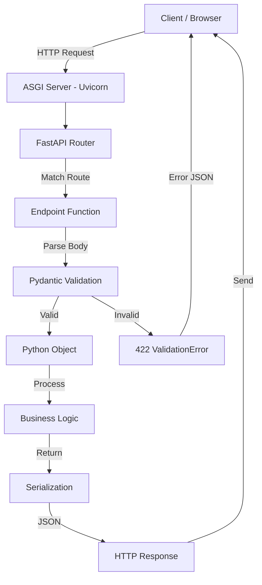
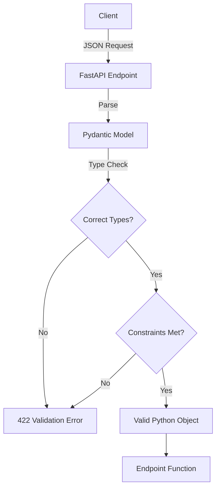
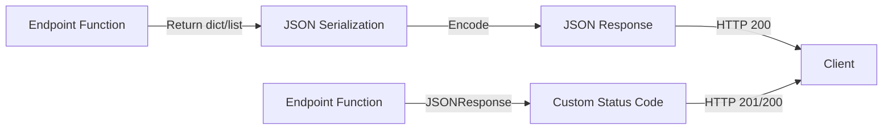
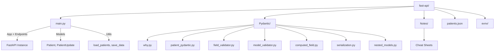

# FastAPI Revision Cheat Sheet

> **Quick Revision Guide** — Cover all FastAPI concepts in 15-20 minutes before interviews.

---

## 1. What is FastAPI?

FastAPI is a modern, high-performance Python web framework for building APIs. Built on **Starlette** (web toolkit) and **Pydantic** (data validation).

**Why it was created:** To provide automatic validation, documentation, and type safety without boilerplate — combining the best of Flask (simple) and Django (batteries-included).

**Why companies use it:**
- ⚡ **Performance** — One of the fastest Python frameworks (on par with Node.js, Go)
- 📖 **Auto Docs** — Swagger UI and ReDoc generated automatically
- ✅ **Validation** — Pydantic validates request/response at runtime
- 🔒 **Type Safety** — Type hints catch bugs before runtime
- 🚀 **Async Support** — Native `async/await` for concurrent operations
- 📦 **Standards Based** — OpenAPI (Swagger) and JSON Schema compliant

**Why it's fast:**
- ASGI server (Uvicorn with uvloop)
- No unnecessary middleware overhead
- Pydantic V2 written in Rust (core validation)
- Async I/O for non-blocking operations

⭐ **Interview Point:** FastAPI is an **ASGI** framework (not WSGI). ASGI supports async, WebSockets, and long-polling. WSGI (Flask/Django traditional) is synchronous only.

---

## 2. FastAPI Request Lifecycle



**Step-by-step:**
1. **Client** sends HTTP request (GET, POST, etc.)
2. **Uvicorn** (ASGI server) receives and passes to FastAPI
3. **Router** matches URL path to correct endpoint function
4. **Pydantic** validates request body / query params / path params
5. **Endpoint** executes business logic
6. **Response** is serialized to JSON and sent back

---

## 3. FastAPI Concepts Covered

| Concept | Purpose | Source File |
|---------|---------|-------------|
| `FastAPI()` | Create app instance | `main.py` |
| `@app.get()` | Define GET endpoint | `main.py` |
| `@app.post()` | Define POST endpoint | `main.py` |
| `@app.put()` | Define PUT endpoint | `main.py` |
| `@app.delete()` | Define DELETE endpoint | `main.py` |
| Path Parameters | Dynamic URL segments `{id}` | `main.py` |
| Query Parameters | URL query string `?key=value` | `main.py` |
| Request Body | JSON body parsed to Pydantic | `main.py` |
| `BaseModel` | Pydantic model for validation | `main.py` |
| `Field()` | Constraints & metadata | `main.py` |
| `Annotated` | Type metadata attachment | `main.py` |
| `computed_field` | Derived fields (BMI, verdict) | `main.py` |
| `Literal` | Fixed allowed values | `main.py` |
| `Optional` | Nullable fields | `main.py` |
| `HTTPException` | Raise HTTP errors | `main.py` |
| `JSONResponse` | Custom response with status code | `main.py` |
| `Path()` | Path parameter metadata | `main.py` |
| `Query()` | Query parameter metadata | `main.py` |
| `model_dump()` | Serialize Pydantic to dict | `main.py` |
| `model_dump(exclude_unset=True)` | Partial updates | `main.py` |
| Uvicorn | ASGI server | `main.py` |

---

## 4. FastAPI Syntax Cheat Sheet

### App Initialization
```python
from fastapi import FastAPI
app = FastAPI()
```

### HTTP Endpoints
```python
@app.get("/path")           # GET request
@app.post("/path")          # POST request
@app.put("/path/{id}")      # PUT request (full update)
@app.patch("/path/{id}")    # PATCH request (partial update)
@app.delete("/path/{id}")   # DELETE request
```

### Path Parameters
```python
@app.get("/patient/{patient_id}")
def get_patient(patient_id: str):
    ...
```

### Path Parameter with Validation
```python
@app.get("/patient/{patient_id}")
def get_patient(patient_id: str = Path(..., description="Patient ID")):
    ...
```

### Query Parameters
```python
@app.get("/sort")
def sort(sort_by: str = Query(..., description="Field to sort"),
         order: str = Query("asc", description="Sort order")):
    ...
```

### Request Body
```python
@app.post("/create")
def create(patient: Patient):  # Patient is a BaseModel
    ...
```

### Response with Status Code
```python
from fastapi.responses import JSONResponse

return JSONResponse(status_code=201, content={"message": "Created"})
```

### Raising HTTP Errors
```python
from fastapi import HTTPException

raise HTTPException(status_code=404, detail="Not found")
```

---

## 5. HTTP Methods Cheat Sheet

| Method | Purpose | Idempotent | Has Body | Real Example |
|--------|---------|------------|----------|--------------|
| **GET** | Read/Retrieve data | ✅ Yes | ❌ No | `GET /view` — list all patients |
| **POST** | Create new resource | ❌ No | ✅ Yes | `POST /create` — add new patient |
| **PUT** | Replace entire resource | ✅ Yes | ✅ Yes | `PUT /update/{id}` — full update |
| **PATCH** | Partial update | ✅ Yes | ✅ Yes | `PATCH /update/{id}` — update name only |
| **DELETE** | Remove resource | ✅ Yes | ❌ No | `DELETE /delete/{id}` — remove patient |

⭐ **Interview Point:** **Idempotent** means calling the same request multiple times produces the same result. GET, PUT, DELETE are idempotent. POST is NOT.

---

## 6. Path vs Query vs Body Parameters

| Type | Syntax | Location | Use Case | Example |
|------|--------|----------|----------|---------|
| **Path** | `/patient/{id}` | URL path | Identify resource | `patient_id: str` |
| **Query** | `/sort?sort_by=age` | URL `?key=val` | Filter/Sort/Paginate | `sort_by: str = Query(...)` |
| **Body** | JSON in request body | Request body | Send complex data | `patient: Patient` |

### Examples from Project

```python
# Path Parameter — identifies the patient
@app.get("/patient/{patient_id}")
def view_patient(patient_id: str): ...

# Query Parameter — sorts patients
@app.get("/sort")
def sort_patient(sort_by: str = Query(...), order: str = Query("asc")): ...

# Request Body — creates a patient
@app.post("/create")
def create_patient(patient: Patient): ...
```

---

## 7. Validation Flow



**What Pydantic validates:**
- Type correctness (`"abc"` for `int` field → error)
- Constraints (`gt=0, lt=100` → range check)
- Required fields (missing → error)
- `Literal["Male", "Female"]` → only allowed values
- `EmailStr` → valid email format
- `Optional` fields → allows `None`

⭐ **Interview Point:** Validation happens **before** your endpoint code runs. If validation fails, FastAPI returns `422 Unprocessable Entity` automatically.

---

## 8. Response Flow



**Two ways to return responses:**

```python
# 1. Return dict/list → FastAPI auto-converts to JSON (200 OK)
@app.get("/view")
def view():
    return load_patients()  # dict → JSON automatically

# 2. JSONResponse → explicit status code
@app.post("/create")
def create(patient: Patient):
    return JSONResponse(status_code=201, content={"message": "Created"})
```

---

## 9. FastAPI Internals

| Component | What It Does |
|-----------|--------------|
| **Route Registration** | `@app.get()` decorator registers function + path in router |
| **Dependency Injection** | `Depends()` injects services, DB sessions, auth into endpoints |
| **Validation** | Pydantic models validate all inputs before endpoint runs |
| **Serialization** | Return values auto-converted to JSON via Pydantic |
| **OpenAPI Generation** | Auto-generates OpenAPI spec from type hints + docstrings |
| **Swagger UI** | `/docs` — interactive API documentation |
| **ReDoc** | `/redoc` — alternative documentation format |
| **Error Handling** | `HTTPException` → structured JSON error responses |
| **Async Support** | `async def` endpoints run concurrently |

⭐ **Interview Point:** FastAPI generates **OpenAPI spec** automatically. This powers Swagger UI (`/docs`), ReDoc (`/redoc`), and client SDK generators.

---

## 10. Status Codes Cheat Sheet

| Code | Meaning | When Used |
|------|---------|-----------|
| **200** | OK | Successful GET, PUT, DELETE |
| **201** | Created | Successful POST (resource created) |
| **204** | No Content | Successful DELETE (no response body) |
| **400** | Bad Request | Invalid query params, bad input |
| **401** | Unauthorized | Missing/invalid authentication |
| **403** | Forbidden | Authenticated but no permission |
| **404** | Not Found | Resource doesn't exist |
| **409** | Conflict | Duplicate resource (e.g., patient already exists) |
| **422** | Unprocessable Entity | Validation error (Pydantic fails) |
| **500** | Internal Server Error | Server-side bug |

### From the Project

```python
raise HTTPException(status_code=404, detail="Patient not found")
raise HTTPException(status_code=400, detail="Patient already exists")
return JSONResponse(status_code=201, content={"message": "Patient created"})
return JSONResponse(status_code=200, content={"message": "Patient updated"})
```

---

## 11. Request & Response Objects

| Object | Purpose | Import |
|--------|---------|--------|
| `Request` | Raw HTTP request (headers, body, method) | `from fastapi import Request` |
| `Response` | Base response class | `from fastapi import Response` |
| `JSONResponse` | JSON response with custom status | `from fastapi.responses import JSONResponse` |
| `HTTPException` | Raise structured HTTP errors | `from fastapi import HTTPException` |
| `Path()` | Path parameter metadata/validation | `from fastapi import Path` |
| `Query()` | Query parameter metadata/validation | `from fastapi import Query` |
| `Body()` | Request body metadata | `from fastapi import Body` |
| `Header()` | Header parameter metadata | `from fastapi import Header` |
| `Cookie()` | Cookie parameter metadata | `from fastapi import Cookie` |

---

## 12. Common Decorators & Functions

| Decorator/Function | Purpose | Example |
|--------------------|---------|---------|
| `@app.get()` | Register GET endpoint | `@app.get("/view")` |
| `@app.post()` | Register POST endpoint | `@app.post("/create")` |
| `@app.put()` | Register PUT endpoint | `@app.put("/update/{id}")` |
| `@app.patch()` | Register PATCH endpoint | `@app.patch("/update/{id}")` |
| `@app.delete()` | Register DELETE endpoint | `@app.delete("/delete/{id}")` |
| `Depends()` | Inject dependencies | `def route(db: Session = Depends(get_db))` |
| `Field()` | Field constraints + metadata | `Field(..., gt=0, lt=100)` |
| `Query()` | Query param metadata | `Query(..., description="Sort field")` |
| `Path()` | Path param metadata | `Path(..., description="Patient ID")` |
| `Body()` | Body param metadata | `Body(..., description="Patient data")` |

---

## 13. Common Errors

| Problem | Reason | Fix |
|---------|--------|-----|
| **422 Validation Error** | Pydantic validation failed | Check types, required fields, constraints |
| **404 Not Found** | URL path doesn't match any route | Check URL spelling, method, path params |
| **405 Method Not Allowed** | Wrong HTTP method for route | Use correct method (GET vs POST) |
| **400 Bad Request** | Custom validation failed | Check query params, business rules |
| **500 Server Error** | Unhandled exception in endpoint | Add try/except, check server logs |
| **Import Error** | Missing package | `pip install fastapi uvicorn` |
| **Missing Body** | POST/PUT without JSON body | Send JSON in request body |
| **Wrong Data Type** | String for int field | Match types in request |
| **Extra Fields** | Unknown fields in request body | Remove extra fields or use `model_config` |

---

## 14. Best Practices

✔ **Use `APIRouter`** — Split routes into separate files for large projects

✔ **Separate Pydantic schemas** — Don't mix models with endpoint logic

✔ **Keep business logic separate** — Endpoints should be thin; logic in service layer

✔ **Use `Annotated` + `Field()`** — Clean syntax with metadata and constraints

✔ **Use `model_dump(exclude_unset=True)`** — For partial updates (PATCH/PUT)

✔ **Proper status codes** — 201 for create, 200 for success, 404 for not found

✔ **Consistent naming** — Plural nouns for resources (`/patients`, not `/patient`)

✔ **Type hints everywhere** — FastAPI relies on them for validation + docs

✔ **Use `HTTPException`** — Don't return raw dicts for errors

✔ **Use computed fields** — For derived data (BMI, full name, etc.)

---

## 15. Project Folder Structure



| Folder/File | Purpose |
|-------------|---------|
| `main.py` | FastAPI app, endpoints, Pydantic models, CRUD logic |
| `Pydantic/` | Pydantic concept examples (validation, serialization, etc.) |
| `Notes/` | Revision cheat sheets |
| `patients.json` | JSON file acting as database |
| `evnv/` | Virtual environment with dependencies |

---

## 16. API Design Best Practices

### REST Naming Conventions
| Pattern | Example | Purpose |
|---------|---------|---------|
| `/resource` | `/patients` | List all |
| `/resource/{id}` | `/patients/P001` | Get one |
| `/resource` POST | `/create` | Create new |
| `/resource/{id}` PUT | `/update/{id}` | Full update |
| `/resource/{id}` DELETE | `/delete/{id}` | Delete one |

### Key Principles
- **Use plural nouns** — `/patients` not `/patient`
- **Use HTTP verbs** — GET reads, POST creates, PUT updates, DELETE removes
- **Version your API** — `/api/v1/patients`
- **Validate at entry** — Pydantic models on all inputs
- **Consistent responses** — Same JSON structure across endpoints
- **Proper error format** — `{"detail": "error message"}`

---

## 17. Interview Questions (50)

### Beginner (1-15)

1. **What is FastAPI?**
   → Modern Python web framework for building APIs with automatic validation and docs.

2. **Why is FastAPI fast?**
   → Built on Starlette (async), Pydantic V2 (Rust core), and uvloop.

3. **What is ASGI?**
   → Asynchronous Server Gateway Interface — supports async, WebSockets, unlike WSGI.

4. **How do you create a FastAPI app?**
   → `app = FastAPI()`

5. **How do you run a FastAPI app?**
   → `uvicorn main:app --reload`

6. **What is Pydantic?**
   → Data validation library using Python type hints for runtime validation.

7. **What is a path parameter?**
   → Dynamic value in URL: `@app.get("/patient/{id}")`

8. **What is a query parameter?**
   → Key-value pair after `?` in URL: `/sort?sort_by=age&order=asc`

9. **What is a request body?**
   → JSON data sent in POST/PUT request, parsed by Pydantic model.

10. **What does `HTTPException` do?**
    → Raises a structured HTTP error with status code and detail message.

11. **What status code means "Not Found"?**
    → 404

12. **What status code means "Created"?**
    → 201

13. **What is `JSONResponse`?**
    → Response class for custom status codes and content.

14. **What is `model_dump()`?**
    → Converts Pydantic model instance to Python dictionary.

15. **What is Swagger UI?**
    → Interactive API docs at `/docs` auto-generated from OpenAPI spec.

### Intermediate (16-35)

16. **Difference between GET and POST?**
    → GET reads data (no body), POST creates data (has body).

17. **Difference between PUT and PATCH?**
    → PUT replaces entire resource, PATCH updates partial fields.

18. **What is `Field()` used for?**
    → Add constraints (gt, lt), defaults, and metadata to Pydantic fields.

19. **What is `Annotated` in Pydantic?**
    → Attaches metadata to types: `Annotated[int, Field(gt=0)]`

20. **What is `computed_field`?**
    → Derived field calculated from other fields (e.g., BMI from weight/height).

21. **What is `Literal` type?**
    → Restricts value to fixed set: `Literal["Male", "Female"]`

22. **What is `Optional`?**
    → Allows field to be `None`: `Optional[str] = None`

23. **How do you validate path parameters?**
    → `patient_id: str = Path(..., description="ID")`

24. **How do you validate query parameters?**
    → `sort_by: str = Query(..., description="Field")`

25. **What is `model_dump(exclude_unset=True)`?**
    → Returns only fields explicitly set — used for partial updates.

26. **How do you handle duplicate resources?**
    → Check existence, raise `HTTPException(status_code=409)`

27. **What is dependency injection in FastAPI?**
    → `Depends()` injects reusable logic (DB, auth) into endpoints.

28. **How do you separate routes in large projects?**
    → Use `APIRouter` to split routes into modules.

29. **What is OpenAPI?**
    → Standard for API documentation; FastAPI generates it automatically.

30. **What is the difference between `400` and `422`?**
    → 400 = bad request (your custom validation), 422 = Pydantic validation error.

31. **How do you return a list of items?**
    → `return [item1, item2]` — FastAPI auto-converts to JSON array.

32. **How do you access path parameters?**
    → Function argument with same name: `def get(id: str)` matches `{id}`.

33. **How do you set default query params?**
    → `order: str = Query("asc")` — defaults to "asc" if not provided.

34. **What is `...` (Ellipsis) in Field?**
    → Means field is required with no default value.

35. **How do you exclude fields from serialization?**
    → `model.dump(exclude={'field_name'})`

### Advanced (36-50)

36. **How does FastAPI handle async endpoints?**
    → Use `async def` for I/O-bound operations; runs concurrently.

37. **What is the difference between `def` and `async def` endpoints?**
    → `async def` is non-blocking; `def` runs in thread pool (blocking).

38. **How does FastAPI generate OpenAPI docs?**
    → From Pydantic models, type hints, and docstrings on endpoints.

39. **How do you version an API?**
    → Prefix routes: `/api/v1/patients`, `/api/v2/patients`

40. **How do you handle authentication?**
    → Use `Depends()` with security utilities: `OAuth2PasswordBearer`

41. **What middleware does FastAPI use?**
    → Starlette middleware stack (CORS, GZip, etc.)

42. **How do you handle CORS?**
    → `app.add_middleware(CORSMiddleware, allow_origins=["*"])`

43. **What is the difference between `response_model` and returning dict?**
    → `response_model` filters output; returning dict sends everything.

44. **How do you test FastAPI endpoints?**
    → `TestClient` from `fastapi.testclient` or `httpx.AsyncClient`.

45. **How do you handle file uploads?**
    → `UploadFile` type: `def upload(file: UploadFile): ...`

46. **What are lifespan events?**
    → Startup/shutdown hooks using `@app.on_event("startup")` or lifespan context.

47. **How do you structure a production FastAPI project?**
    → `routers/`, `schemas/`, `models/`, `services/`, `utils/`, `dependencies/`

48. **How do you handle background tasks?**
    → `BackgroundTasks` parameter: `def route(tasks: BackgroundTasks): tasks.add_task(...)`

49. **What is the difference between `status_code` in decorator vs `JSONResponse`?**
    → Decorator sets default; `JSONResponse` overrides per-response.

50. **How do you deploy FastAPI?**
    → Uvicorn + Gunicorn (multi-worker), Docker, or cloud platforms (Railway, Render, AWS).

---

## 18. Quick Revision Tables

### HTTP Methods

| Method | Use | Body | Idempotent |
|--------|-----|------|------------|
| GET | Read | No | Yes |
| POST | Create | Yes | No |
| PUT | Replace | Yes | Yes |
| PATCH | Update | Yes | Yes |
| DELETE | Remove | No | Yes |

### Decorators

| Decorator | Purpose |
|-----------|---------|
| `@app.get()` | Register GET route |
| `@app.post()` | Register POST route |
| `@app.put()` | Register PUT route |
| `@app.patch()` | Register PATCH route |
| `@app.delete()` | Register DELETE route |

### Parameters

| Parameter | Purpose | Example |
|-----------|---------|---------|
| Path | Identify resource | `/patient/{id}` |
| Query | Filter/Sort | `?sort_by=age` |
| Body | Send data | JSON in request |
| Header | Metadata | `Authorization: Bearer ...` |
| Cookie | Session data | `session=abc123` |

### Status Codes

| Code | Meaning |
|------|---------|
| 200 | OK |
| 201 | Created |
| 204 | No Content |
| 400 | Bad Request |
| 401 | Unauthorized |
| 403 | Forbidden |
| 404 | Not Found |
| 409 | Conflict |
| 422 | Validation Error |
| 500 | Server Error |

### Response Types

| Response | Use |
|----------|-----|
| `dict` / `list` | Auto JSON (200 OK) |
| `JSONResponse` | Custom status code |
| `HTTPException` | Error response |
| `Response` | Raw response (headers, media type) |

---

## 19. Common Beginner Mistakes

| Mistake | Why It's Wrong | Correct Approach |
|---------|----------------|------------------|
| Business logic inside routes | Hard to test, maintain | Separate into service layer |
| No `response_model` | Exposes internal fields | Define response schemas |
| Using GET for create | Violates HTTP semantics | Use POST for creation |
| Returning non-serializable objects | Serialization fails | Use Pydantic models or dicts |
| Not using Pydantic for body | No validation | Always use BaseModel for request body |
| Hardcoding status codes | Inconsistent responses | Use `HTTPException` with proper codes |
| No type hints | FastAPI can't validate | Add types to all parameters |
| Ignoring `Optional` | Fields become required | Use `Optional[T] = None` for nullable |
| Mutable default values | Shared state bugs | Use `None` default + check inside |
| No folder structure | Messy codebase | Separate routers, schemas, services |

---

## 20. Memory Tricks

| Concept | Mental Model |
|---------|--------------|
| **GET** | 📖 Read — like reading a book |
| **POST** | ✏️ Create — like writing a new page |
| **PUT** | 🔄 Replace — like rewriting the whole page |
| **PATCH** | ✏️ Update — like editing a paragraph |
| **DELETE** | 🗑️ Remove — like tearing a page |
| **Path Parameter** | 🏠 Address — identifies WHERE (resource) |
| **Query Parameter** | 🔍 Filter — like search filters |
| **Body** | 📦 Package — the actual data payload |
| **Pydantic** | 🛡️ Security Guard — checks everything |
| **FastAPI** | 🚦 Traffic Controller — routes requests |
| **Serialization** | 🔄 Translator — Python ↔ JSON |
| **HTTPException** | 🚨 Alarm — signals something went wrong |
| **Status Code** | 📊 Result Code — tells client what happened |
| **Uvicorn** | ⚡ Engine — powers the FastAPI server |
| **OpenAPI** | 📋 Blueprint — describes the API |

---

## 21. One-Page Revision

- **FastAPI** = modern Python API framework (ASGI, async, auto-docs)
- **`app = FastAPI()`** — create app instance
- **`uvicorn main:app --reload`** — run development server
- **`@app.get("/path")`** — register GET endpoint
- **`@app.post("/path")`** — register POST endpoint
- **`@app.put("/path/{id}")`** — register PUT endpoint
- **`@app.delete("/path/{id}")`** — register DELETE endpoint
- **Path params** — `{id}` in URL, passed as function args
- **Query params** — `?key=val` in URL, defaults optional
- **Request body** — JSON body parsed by Pydantic model
- **`BaseModel`** — base class for Pydantic models
- **`Field()`** — add constraints: `gt`, `lt`, `max_length`
- **`Annotated`** — `Annotated[int, Field(gt=0)]`
- **`Optional`** — `field: Type | None = None`
- **`Literal`** — fixed choices: `Literal["A", "B"]`
- **`computed_field`** — derived fields (BMI, verdict)
- **`HTTPException`** — raise errors with status code
- **`JSONResponse`** — custom status code + content
- **`model_dump()`** — serialize to dict
- **`model_dump(exclude_unset=True)`** — partial updates
- **200** OK, **201** Created, **404** Not Found, **422** Validation Error
- **Swagger UI** at `/docs`, **ReDoc** at `/redoc`
- **REST** = plural nouns + HTTP verbs + status codes
- **Always** use Pydantic for request body validation

---

## 22. Final Mind Map

```mermaid
graph TD
    Root["🚀 FastAPI"]

    Root --> HTTP["HTTP Methods"]
    Root --> Params["Parameters"]
    Root --> Pyd["Pydantic"]
    Root --> SC["Status Codes"]
    Root --> Resp["Response"]
    Root --> Int["Internals"]

    HTTP --> GET["GET — Read, No body"]
    HTTP --> POST["POST — Create, Has body"]
    HTTP --> PUT["PUT — Replace, Has body"]
    HTTP --> PATCH["PATCH — Update, Has body"]
    HTTP --> DELETE["DELETE — Remove, No body"]

    Params --> Path["Path — /resource/{id}"]
    Params --> Query["Query — ?key=value"]
    Params --> Body["Body — JSON payload"]

    Pyd --> BM["BaseModel — Structure"]
    Pyd --> FD["Field — Constraints"]
    Pyd --> VAL["Validation — Type check"]
    Pyd --> SER["Serialization — model_dump"]
    Pyd --> CF["computed_field — Derived"]

    SC --> S200["200 OK"]
    SC --> S201["201 Created"]
    SC --> S404["404 Not Found"]
    SC --> S422["422 Validation Error"]

    Resp --> RD["dict → auto JSON"]
    Resp --> JR["JSONResponse"]
    Resp --> HE["HTTPException"]

    Int --> OA["OpenAPI — Auto generated"]
    Int --> SW["Swagger UI — /docs"]
    Int --> RD2["ReDoc — /redoc"]
    Int --> UV["Uvicorn — ASGI server"]
    Int --> AS["Async — non-blocking"]
```



---

> **Last Updated:** June 2026 | **Source Files:** `main.py`, `Pydantic/*.py`
