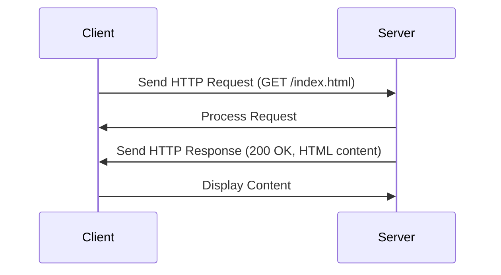
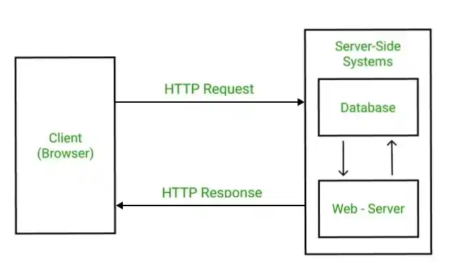
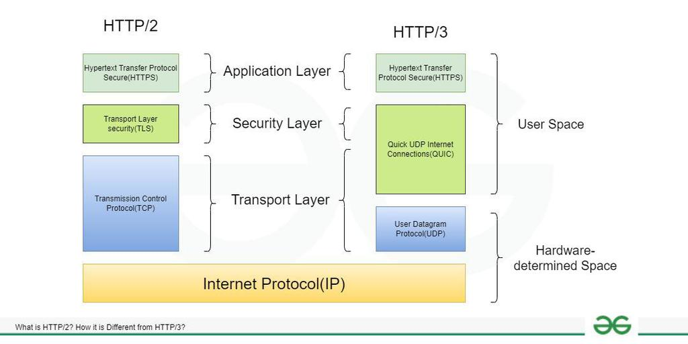

# HTTP - Hypertext Transfer Protocol

HTTP (Hypertext Transfer Protocol) is the foundation of data communication on the World Wide Web. It is a protocol used for transmitting hypertext requests and information between clients (such as web browsers) and servers. HTTP defines how messages are formatted and transmitted, and how web servers and browsers should respond to various commands.

# How HTTP Works: Step-by-Step Process

1. **Client Sends Request**: The process begins when a client (like a web browser) sends an HTTP request to a server. This request includes a method (such as GET, POST, PUT, DELETE), a URL, headers, and sometimes a body (for methods like POST).

2. **Server Receives Request**: The server receives the HTTP request and processes it. The server checks the requested URL, the method used, and any additional data sent in the headers or body.

3. **Server Generates Response**: Based on the request, the server generates an HTTP response. This response includes a status code (indicating success or failure), headers (providing additional information about the response), and a body (which may contain the requested data or an error message).

4. **Client Receives Response**: The client receives the HTTP response from the server. The client can then process the response, display the data to the user, or handle any errors that may have occurred.

5. **Connection Management**: After the response is sent, the server may choose to keep the connection open for further requests (using HTTP/1.1's persistent connections) or close it immediately (as in HTTP/1.0). This allows for more efficient communication between the client and server.

# Mermaid Diagram

In this diagram, the client sends an HTTP GET request to the server for the resource "/index.html". The server processes the request and responds with a 200 OK status and the HTML content. The client then displays the content to the user.

# What is HyperText?

HyperText is a term used to describe text that contains links to other texts. It allows users to navigate between different pieces of information by clicking on hyperlinks. HyperText is the basis of the World Wide Web, enabling users to access and interact with a vast amount of information across the internet.

# Understanding HTTP Request and Response

An HTTP request is a message sent by a client to a server, asking for a specific resource or action. It consists of several components:

# 1. HTTP Request

- **Method**: The HTTP method (e.g., GET, POST, PUT, DELETE) indicates the desired action to be performed on the resource.

- **URL**: The Uniform Resource Locator (URL) specifies the location of the resource on the server.

- **Headers**: HTTP headers provide additional information about the request, such as content type, authentication credentials, and caching directives.

- **Body**: The body of the request contains data sent by the client, typically used in POST and PUT requests to submit form data or JSON payloads.

# 2. HTTP Response

An HTTP response is a message sent by the server back to the client in response to an HTTP request. It also consists of several components:

- **Status Code**: The status code indicates the result of the request (e.g., 200 OK, 404 Not Found, 500 Internal Server Error).
- **Headers**: HTTP headers in the response provide additional information about the response, such as content type, caching directives, and server information.

- **Body**: The body of the response contains the data sent by the server, which can be HTML, JSON, XML, or any other format depending on the request and the server's response.

# What is HTTP Status Code?

HTTP status codes are standardized codes that indicate the outcome of an HTTP request. They are categorized into five classes based on the first digit of the code:

- **1xx (Informational)**: These codes indicate that the request has been received and is being processed. They are typically used for informational purposes and do not indicate a final response.

- **2xx (Successful)**: These codes indicate that the request was successfully received, understood, and accepted. For example, 200 OK means that the request was successful and the server is returning the requested data.

- **3xx (Redirection)**: These codes indicate that further action is needed to complete the request. They are used for URL redirection and indicate that the client should make a new request to a different URL.

- **4xx (Client Error)**: These codes indicate that there was an error with the client's request. For example, 404 Not Found means that the requested resource could not be found on the server.

- **5xx (Server Error)**: These codes indicate that there was an error on the server while processing the request. For example, 500 Internal Server Error means that the server encountered an unexpected condition that prevented it from fulfilling the request.

# Advantages of HTTP

- **Simplicity**: HTTP is a simple protocol that is easy to understand and implement. It uses a straightforward request-response model, making it accessible for developers of all skill levels.

- **Statelessness**: HTTP is a stateless protocol, meaning that each request is independent and does not require the server to maintain any information about previous requests. This allows for scalability and flexibility in handling multiple requests.

- **Wide Adoption**: HTTP is widely adopted and supported by all major web browsers and servers. This makes it a universal protocol for communication on the web.

- **Extensibility**: HTTP can be extended with additional headers and methods to support new features and functionality. This allows developers to customize the protocol to meet their specific needs.

- **Security**: HTTP can be secured using HTTPS (HTTP Secure), which encrypts the data transmitted between the client and server. This helps protect sensitive information from being intercepted by malicious actors.

- **Caching**: HTTP supports caching mechanisms that allow clients and servers to store and reuse responses. This can improve performance and reduce the load on the server by avoiding unnecessary requests.

- **Content Negotiation**: HTTP allows clients and servers to negotiate the content type and format of the response. This enables the server to provide different representations of the same resource based on the client's preferences.

# Disadvantages of HTTP

- **Performance**: HTTP can be slower than other protocols due to its stateless nature and the overhead of establishing connections for each request. This can lead to increased latency, especially for applications that require frequent communication between the client and server.

- **Security Vulnerabilities**: HTTP is vulnerable to various security threats, such as man-in-the-middle attacks, cross-site scripting (XSS), and cross-site request forgery (CSRF). While HTTPS can mitigate some of these risks, it does not eliminate them entirely.

- **Lack of State Management**: Since HTTP is stateless, it does not provide built-in mechanisms for managing user sessions or maintaining state across multiple requests. This can make it more challenging to implement features that require persistent user interactions.

- **Limited Functionality**: HTTP is primarily designed for transferring hypertext and may not be suitable for all types of applications. For example, real-time applications that require low latency and bidirectional communication may benefit from using WebSockets or other protocols instead.

- **Bandwidth Overhead**: HTTP can have a significant bandwidth overhead due to the need to include headers and establish connections for each request. This can be particularly problematic for mobile applications or applications with limited network resources.

- **Complexity in Handling Large Data**: HTTP is not optimized for handling large data transfers, such as streaming media or file uploads. This can lead to performance issues and increased latency when dealing with large payloads.

In summary, while HTTP is a widely used and versatile protocol for communication on the web, it has its advantages and disadvantages. It is important for developers to consider these factors when designing and implementing web applications to ensure optimal performance, security, and user experience.