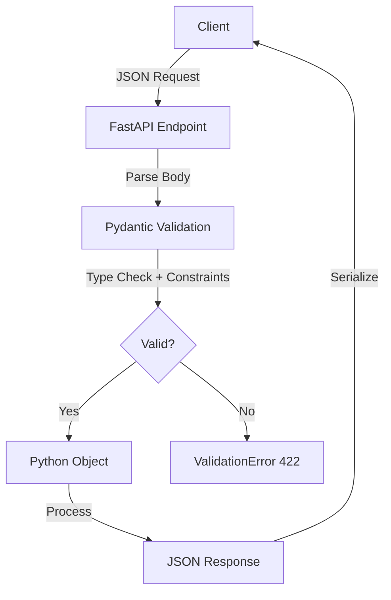
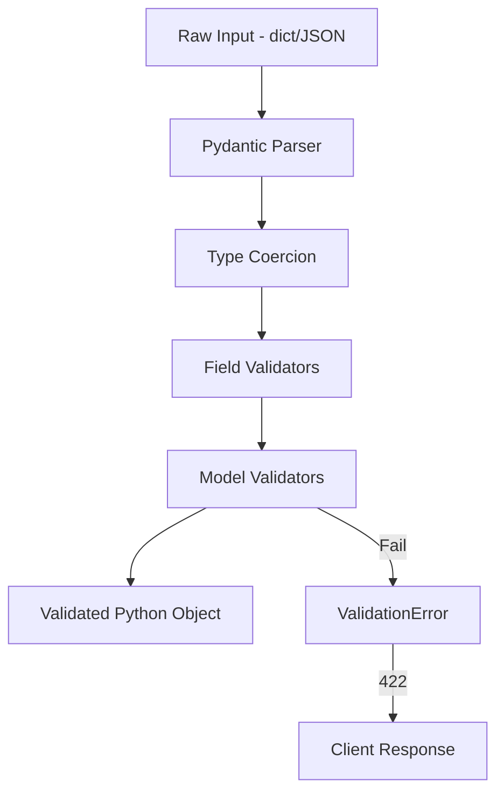
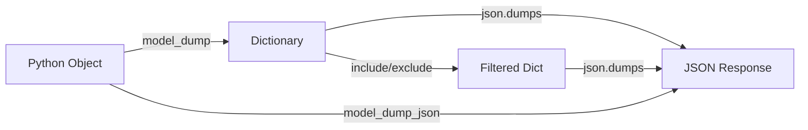
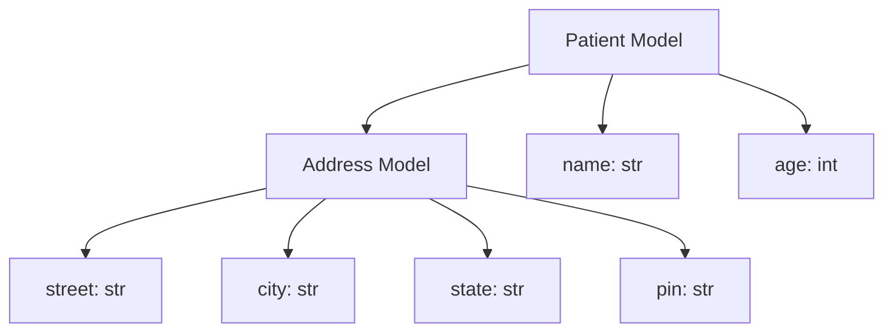
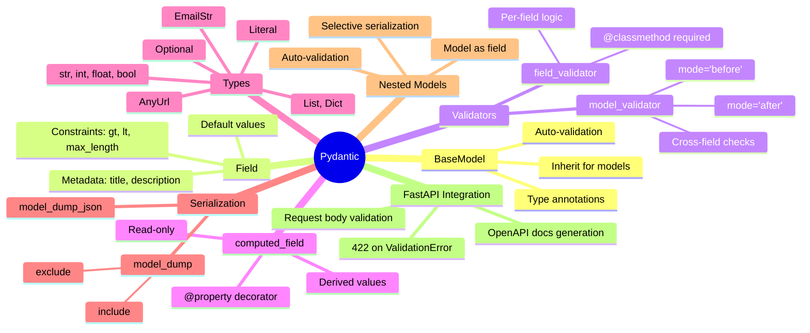

# Pydantic Revision Cheat Sheet

> **Quick Revision Guide** — Cover the complete Pydantic module in 10-15 minutes before interviews.

---

## 1. What is Pydantic?

Pydantic is a **data validation and settings management** library for Python that uses **type annotations** to validate data. It enforces types at runtime and raises clear errors on invalid input.

**Why FastAPI uses it:** FastAPI relies on Pydantic to validate request bodies, query parameters, and path parameters automatically. It also generates OpenAPI docs from Pydantic models.

**Why BaseModel exists:** `BaseModel` is the foundation class you inherit from to define structured, validated data models — like a blueprint with built-in type checking.

⭐ **Interview Point:** Pydantic validates at **runtime**, not compile time. It coerces types when possible (e.g., `"42"` → `42` for `int` fields).

---

## 2. Request Flow



---

## 3. Pydantic Concepts Covered

| Concept | Purpose | Source File |
|---------|---------|-------------|
| `BaseModel` | Base class for all Pydantic models | `why.py` |
| `Field()` | Add constraints, defaults, metadata to fields | `patient_pydantic.py` |
| `Annotated` | Attach metadata to type hints | `patient_pydantic.py` |
| `Optional` | Make fields optional (allow `None`) | `patient_pydantic.py` |
| `EmailStr` | Validate email format | `field_validator.py` |
| `AnyUrl` | Validate URLs | `patient_pydantic.py` |
| `List`, `Dict` | Typed collections | `patient_pydantic.py` |
| `field_validator` | Per-field custom validation | `field_validator.py` |
| `model_validator` | Whole-model custom validation | `model_validator.py` |
| `computed_field` | Derived/calculated fields | `computed_field.py` |
| `Nested Models` | Models inside models | `nested_models.py` |
| `model_dump()` | Serialize to dictionary | `serialization.py` |
| `model_dump(exclude/include)` | Selective serialization | `serialization.py` |
| Default values | Provide fallback values | `patient_pydantic.py` |
| `strict=True` | Disable type coercion | `patient_pydantic.py` |

---

## 4. Syntax Cheat Sheet

### Basic Model
```python
from pydantic import BaseModel

class User(BaseModel):
    name: str
    age: int
```

### Field with Constraints
```python
from pydantic import Field
from typing import Annotated

age: Annotated[int, Field(gt=0, lt=120)]
name: Annotated[str, Field(max_length=50, title="Name")]
```

### Optional Fields
```python
from typing import Optional

email: Optional[str] = None          # Optional with default None
email: str | None = None             # Python 3.10+ syntax
```

### Email & URL Validation
```python
from pydantic import EmailStr, AnyUrl

email: EmailStr
website: Optional[AnyUrl] = None
```

### Collections
```python
from typing import List, Dict

tags: List[str]
metadata: Dict[str, str]
```

### field_validator
```python
from pydantic import field_validator

@field_validator('email')
@classmethod
def validate_email(cls, v):
    if not v.endswith('@example.com'):
        raise ValueError('Must be example.com domain')
    return v
```

### model_validator
```python
from pydantic import model_validator

@model_validator(mode='after')
def check_model(cls, model):
    if model.age > 60 and not model.emergency_contact:
        raise ValueError('Emergency contact required for 60+')
    return model
```

### computed_field
```python
from pydantic import computed_field

@computed_field
@property
def bmi(self) -> float:
    return round(self.weight / (self.height ** 2), 2)
```

### Serialization
```python
model.model_dump()                    # Full dict
model.model_dump(include={'name'})    # Only name
model.model_dump(exclude={'secret'})  # Everything except secret
model.model_dump_json()               # JSON string
```

---

## 5. Validation Flow



⭐ **Interview Point:** Pydantic V2 runs validators in this order: **type coercion → `field_validator` → `model_validator`**.

---

## 6. Serialization Flow



**Key Methods:**
| Function | Returns | Use Case |
|----------|---------|----------|
| `model_dump()` | `dict` | Convert model to dictionary |
| `model_dump_json()` | `str` | Convert model to JSON string |
| `model_dump(include={...})` | `dict` | Only specified fields |
| `model_dump(exclude={...})` | `dict` | All except specified fields |

---

## 7. Common Validators

| Decorator | When to Use | Runs Before/After | Example |
|-----------|-------------|-------------------|---------|
| `@field_validator` | Validate/transform a **single field** | After type coercion | Validate email domain |
| `@model_validator(mode='before')` | Validate raw input **before** field parsing | Before field validators | Transform dict structure |
| `@model_validator(mode='after')` | Validate **after** all fields are parsed | After field validators | Cross-field checks |

### Quick Examples

**field_validator** — Validate email domain:
```python
@field_validator('email')
@classmethod
def validate_email(cls, v):
    valid = ['hdfc.com', 'icici.com']
    domain = v.split('@')[-1]
    if domain not in valid:
        raise ValueError(f'Email must be: {valid}')
    return v
```

**field_validator** — Transform data:
```python
@field_validator('name')
@classmethod
def transform_name(cls, v):
    return v.upper()  # Auto-capitalize
```

**model_validator** — Cross-field check:
```python
@model_validator(mode='after')
def validate_emergency(cls, model):
    if model.age > 60:
        if 'emergency_contact' not in model.contact_details:
            raise ValueError('Emergency contact required for 60+')
    return model
```

---

## 8. computed_field

**Why it exists:** To define fields that are **derived from other fields** — computed automatically, not stored in DB.

**When to use:**
- BMI from weight & height
- Full name from first + last name
- Any calculated value based on model fields

```python
@computed_field
@property
def bmi(self) -> float:
    return round(self.weight / (self.height ** 2), 2)
```

⭐ **Interview Points:**
- `computed_field` uses `@property` decorator under the hood
- The field is **read-only** — it's computed, not set
- Appears in serialization output by default
- Replaces manual property + serializer patterns

---

## 9. Nested Models

One model can contain **another model as a field** — enabling complex, hierarchical data structures.



**Syntax:**
```python
class Address(BaseModel):
    street: str
    city: str
    state: str
    pin: str

class Patient(BaseModel):
    name: str
    age: int
    address: Address  # Nested model
```

**Accessing nested data:**
```python
patient.address.city    # "New York"
patient.address.pin     # "10001"
```

**Selective serialization of nested models:**
```python
patient.model_dump(include={'address'})              # Only address
patient.model_dump(exclude={'address': {'street'}})  # Address without street
```

⭐ **Interview Point:** Nested models auto-validate the nested dict. If you pass `{"street": 123}`, Pydantic coerces it to `"123"` (string) — unless `strict=True`.

---

## 10. Common Errors

| Problem | Reason | Fix |
|---------|--------|-----|
| `ValidationError: Field required` | Missing required field in input | Add field to request body or set default |
| `ValidationError: Input should be a valid integer` | Type mismatch (e.g., string for int) | Send correct type or use coercion |
| `ValidationError: Extra inputs are not permitted` | Extra fields not allowed | Remove extra field or set `model_config` |
| `EmailStr: value is not a valid email` | Invalid email format | Use proper email format |
| `ValueError: Age must be between 1 and 49` | Custom validator failed | Fix input to meet validator rules |
| `ValidationError: Input should be True or False` | Wrong bool value | Use `true`/`false` (lowercase in JSON) |

---

## 11. Best Practices

✔ **Always inherit from `BaseModel`** — don't use raw dicts for structured data

✔ **Use `Field()` for constraints** — keeps validation logic declarative and clean

✔ **Keep validators small** — one concern per validator function

✔ **Use `Annotated` for metadata** — `Annotated[int, Field(gt=0)]` is cleaner than `conint(gt=0)`

✔ **Prefer `field_validator` over `model_validator`** — field-level is simpler when possible

✔ **Use `computed_field` for derived values** — don't store calculated data in DB

✔ **Use nested models** for complex structures — better validation + readability

✔ **Set `model_config` for extra fields** — `model_config = {"extra": "forbid"}` to reject unknowns

✔ **Use `Optional` with default `None`** — makes API flexible for clients

✔ **Avoid business logic in validators** — validators should only validate, not process

---

## 12. Interview Questions (25)

### Beginner

1. **What is Pydantic?**
   → Data validation library using Python type annotations for runtime validation.

2. **What is BaseModel?**
   → Base class you inherit from to create validated data models.

3. **Why does FastAPI use Pydantic?**
   → Auto-validates request data and generates OpenAPI docs from model definitions.

4. **How do you define a required field?**
   → `name: str` — no default value = required.

5. **How do you define an optional field?**
   → `name: Optional[str] = None` or `name: str | None = None`.

6. **What does `Field()` do?**
   → Adds constraints (gt, lt, max_length), defaults, and metadata to fields.

7. **What is `model_dump()`?**
   → Converts Pydantic model instance to a Python dictionary.

8. **What is `model_dump_json()`?**
   → Converts model to a JSON-formatted string.

9. **What is `ValidationError`?**
   → Exception raised when input data fails Pydantic validation.

10. **How do you set a default value?**
    → `age: int = 25` or `age: int = Field(default=25)`.

### Intermediate

11. **Difference between `field_validator` and `model_validator`?**
    → `field_validator` validates one field; `model_validator` validates the entire model after all fields are parsed.

12. **What is `Annotated` in Pydantic?**
    → Attaches metadata to types: `Annotated[int, Field(gt=0)]`.

13. **What is `computed_field`?**
    → A derived field calculated from other fields using `@property`.

14. **What is `strict=True` in Field?**
    → Disables type coercion; value must be exact type.

15. **How do you exclude fields from serialization?**
    → `model.dump(exclude={'field_name'})`.

16. **How do you include only specific fields?**
    → `model_dump(include={'name', 'age'})`.

17. **What is `mode='before'` in model_validator?**
    → Runs before field parsing; receives raw input dict.

18. **What is `mode='after'` in model_validator?**
    → Runs after all fields are validated; receives model instance.

19. **How do you validate email format?**
    → Use `EmailStr` type: `email: EmailStr`.

20. **How do you create a nested model?**
    → Use another BaseModel as a field type: `address: Address`.

21. **What is `AnyUrl`?**
    → Pydantic type that validates URL strings.

22. **How do you reject extra fields in a model?**
    → `model_config = {"extra": "forbid"}`.

23. **Can you transform data in a field_validator?**
    → Yes — return a modified value: `return v.upper()`.

24. **What does `**kwargs` unpacking do in `Patient(**data)`?**
    → Unpacks dict keys as keyword arguments to the constructor.

25. **How does Pydantic handle type coercion?**
    → It converts compatible types automatically (e.g., `"42"` → `42` for int) unless `strict=True`.

---

## 13. Quick Revision Tables

### Validators

| Decorator | Purpose |
|-----------|---------|
| `@field_validator('field')` | Validate/transform single field |
| `@model_validator(mode='before')` | Validate raw input before parsing |
| `@model_validator(mode='after')` | Validate model after all fields parsed |

### Serialization

| Function | Returns | Description |
|----------|---------|-------------|
| `model_dump()` | `dict` | Full model as dictionary |
| `model_dump_json()` | `str` | Model as JSON string |
| `model_dump(include={...})` | `dict` | Only listed fields |
| `model_dump(exclude={...})` | `dict` | All except listed fields |

### Field Types

| Type | Use |
|------|-----|
| `str` | Text strings |
| `int` | Integers |
| `float` | Decimal numbers |
| `bool` | True/False |
| `Optional[T]` | T or None |
| `List[T]` | List of T |
| `Dict[K, V]` | Dictionary |
| `EmailStr` | Validated email |
| `AnyUrl` | Validated URL |
| `Literal['a','b']` | Fixed choices |

### Model Functions

| Function | Purpose |
|----------|---------|
| `model_dump()` | Serialize to dict |
| `model_dump_json()` | Serialize to JSON string |
| `model_validate()` | Create model from dict |
| `model_fields` | List all model fields |
| `model_config` | Model configuration dict |

---

## 14. Common Mistakes

| Mistake | Why It's Wrong | Correct Approach |
|---------|----------------|------------------|
| Using `dict()` instead of `model_dump()` | `dict()` doesn't serialize nested models properly | Use `model_dump()` |
| Business logic inside validators | Validators should only validate, not transform DB data | Keep validators pure |
| Forgetting `Optional` | Field becomes required; breaks client flexibility | Use `Optional[T] = None` |
| Mutable default values | Shared state across instances | Use `Field(default_factory=list)` |
| Not using `Annotated` | Miss out on metadata + cleaner syntax | Prefer `Annotated[T, Field()]` |
| Using `model_validator` for single field | Overcomplicates simple validation | Use `field_validator` instead |
| Ignoring `strict=True` | Unexpected type coercion in production | Set `strict=True` for critical fields |

---

## 15. Memory Tricks

| Concept | Mental Model |
|---------|--------------|
| **BaseModel** | 🏗️ Blueprint — defines the structure |
| **Field** | 📏 Constraints — sets the rules |
| **field_validator** | 🚪 Gate — checks each field individually |
| **model_validator** | 🛡️ Guard — checks everything together |
| **computed_field** | 🧮 Calculator — derives value from others |
| **Nested Model** | 📦 Box in Box — model inside model |
| **Serialization** | 🔄 Translator — Python ↔ JSON |
| **model_dump()** | 📋 Export — converts to dict |
| **Optional** | 🤷 Flexible — field can be None |
| **Annotated** | 🏷️ Label — adds metadata to types |

---

## 16. One-Page Revision

- **Pydantic** = runtime data validation using type hints
- **BaseModel** = inherit from this for all models
- **Field()** = add constraints: `gt`, `lt`, `max_length`, `default`
- **Annotated** = `Annotated[int, Field(gt=0)]` — metadata + type
- **Optional** = `field: Type | None = None` — makes field optional
- **EmailStr** = auto-validates email format
- **AnyUrl** = auto-validates URL format
- **List/Dict** = typed collections for structured data
- **field_validator** = validate one field, use `@classmethod`
- **model_validator** = validate whole model, `mode='before'|'after'`
- **computed_field** = derived field using `@property`
- **Nested Models** = model as field type for hierarchy
- **model_dump()** = serialize to dict
- **model_dump_json()** = serialize to JSON string
- **include/exclude** = selective serialization
- **ValidationError** = 422 response when validation fails
- **Validation Order** = type coercion → field_validator → model_validator
- **Best Practice** = keep validators small, no business logic
- **Interview Tip** = know the difference between `mode='before'` and `mode='after'`

---

## 17. Mind Map



---

> **Last Updated:** June 2026 | **Source Files:** `Pydantic/*.py`
