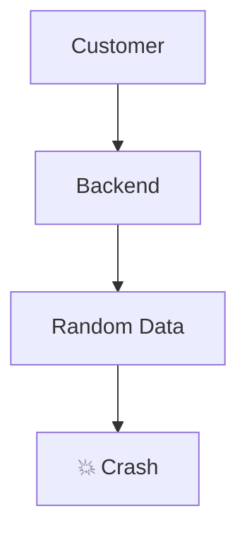
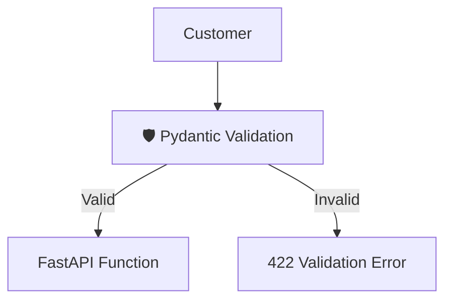
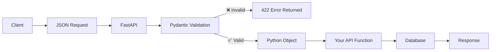
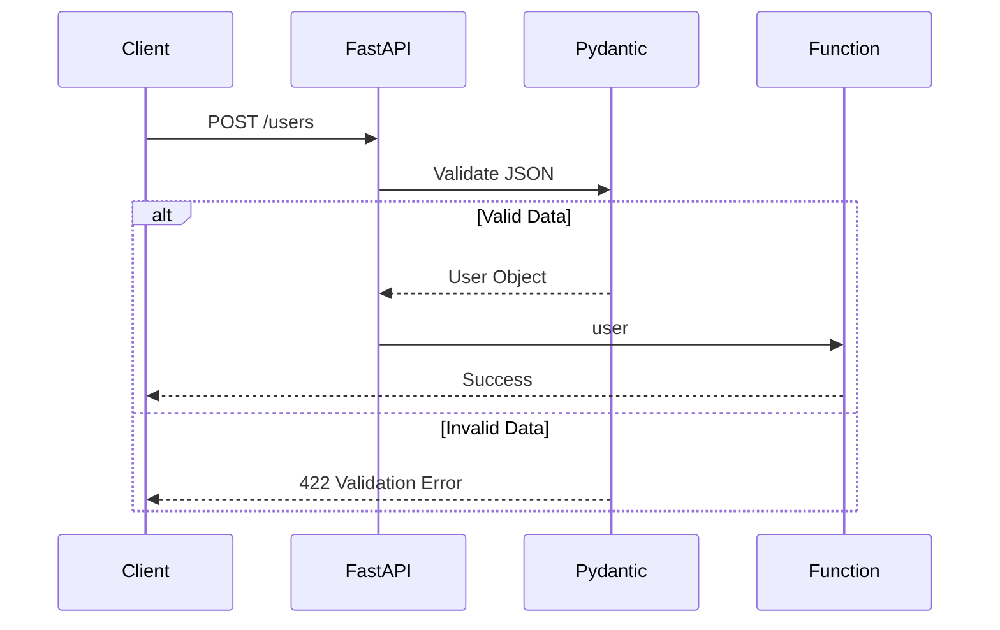
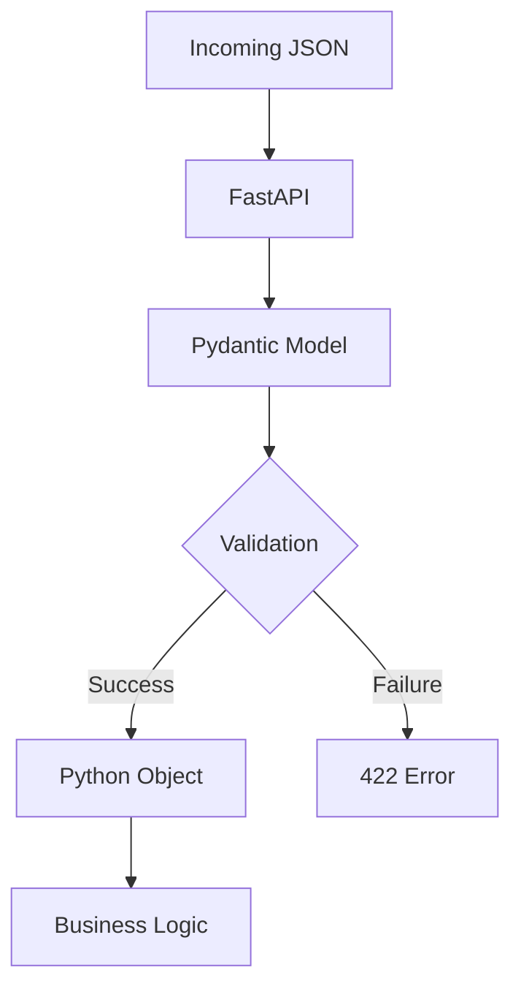
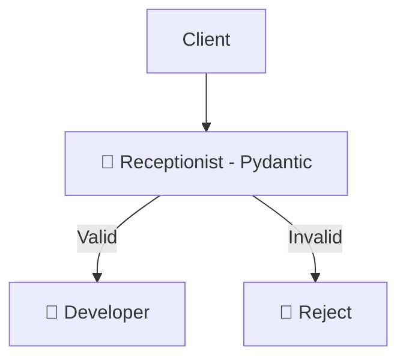

# 🍋 FastAPI + Pydantic Notes (Lemon Language)

> **Goal:** Understand **What is Pydantic? Why do we use it? How does FastAPI use it?**

---

# What is Pydantic?

Pydantic is a Python library used for:

* ✅ Data Validation
* ✅ Data Parsing
* ✅ Type Conversion
* ✅ Error Handling

It ensures that the data coming into your API is correct **before your code runs**.

---

# 🍋 Lemon Example

Imagine you own a Pizza Shop.

A customer orders:

```json
{
    "name": "Himanshu",
    "size": "Large",
    "quantity": 2
}
```

Everything is correct.

But another customer sends:

```json
{
    "name": 12345,
    "size": true,
    "quantity": "ten"
}
```

Without validation your backend crashes.

---

## Without Pydantic



---

## With Pydantic



Pydantic works like a **security guard**.

It checks every request before allowing it inside your application.

---

# Why do we need Pydantic?

Without Pydantic

```python
@app.post("/user")
def create_user(data: dict):
    print(data)
```

Someone sends

```json
{
    "age": "twenty"
}
```

Python accepts it.

Later,

```python
data["age"] + 10
```

Result

```
TypeError
```

---

With Pydantic

```python
from pydantic import BaseModel

class User(BaseModel):
    name: str
    age: int
```

Now FastAPI automatically checks everything.

---

# FastAPI + Pydantic Workflow



---

# Creating Your First Model

```python
from pydantic import BaseModel

class User(BaseModel):
    name: str
    age: int
```

This model says:

* name must be String
* age must be Integer

---

# Using It in FastAPI

```python
from fastapi import FastAPI
from pydantic import BaseModel

app = FastAPI()

class User(BaseModel):
    name: str
    age: int

@app.post("/users")
def create_user(user: User):
    return user
```

FastAPI automatically validates the incoming JSON.

---

# Request Flow



---

# Valid Request

```json
{
    "name": "Himanshu",
    "age": 20
}
```

Output

```
Accepted
```

---

# Invalid Request

```json
{
    "name": "Himanshu",
    "age": "Twenty"
}
```

Output

```json
{
  "detail": [
    {
      "msg": "Input should be a valid integer"
    }
  ]
}
```

Your function never runs.

---

# Automatic Type Conversion

Client sends

```json
{
    "age": "20"
}
```

Pydantic converts

```
"20"
```

↓

```
20
```

Automatically.

---

But

```
"Twenty"
```

cannot become an integer.

Result

```
422 Validation Error
```

---

# Required Fields

```python
class User(BaseModel):
    name: str
    age: int
```

If client sends

```json
{
    "name":"Himanshu"
}
```

Response

```
422 Validation Error
```

Age is required.

---

# Optional Fields

```python
from typing import Optional

class User(BaseModel):
    name: str
    age: Optional[int] = None
```

Now age is optional.

---

# Default Values

```python
class User(BaseModel):
    country: str = "India"
```

If client doesn't send country

Pydantic automatically uses

```
India
```

---

# Nested Models

```python
from pydantic import BaseModel

class Address(BaseModel):
    city: str
    state: str

class User(BaseModel):
    name: str
    address: Address
```

JSON

```json
{
    "name":"Himanshu",
    "address":{
        "city":"Purnea",
        "state":"Bihar"
    }
}
```

Pydantic validates both models.

---

# Lists

```python
class Student(BaseModel):
    skills: list[str]
```

JSON

```json
{
    "skills":[
        "Python",
        "FastAPI",
        "AI"
    ]
}
```

---

# Validation Rules

```python
from pydantic import BaseModel, Field

class User(BaseModel):
    age: int = Field(gt=18)
```

Meaning

```
Age > 18
```

Valid

```
20
```

Invalid

```
17
```

---

# Email Validation

```python
from pydantic import EmailStr

class User(BaseModel):
    email: EmailStr
```

Only valid emails are accepted.

---

# Dictionary vs Pydantic

| Dictionary              | Pydantic                       |
| ----------------------- | ------------------------------ |
| Stores anything         | Validates everything           |
| No type checking        | Type checking                  |
| No automatic conversion | Automatic conversion           |
| Can crash later         | Stops invalid data immediately |
| Manual validation       | Automatic validation           |

---

# Real Life Analogy

Imagine filling a College Admission Form.

The form says:

```
Name → String

Age → Number

CGPA → Decimal
```

Correct submission

```
Name = Himanshu

Age = 20

CGPA = 8.2
```

Accepted ✅

Wrong submission

```
Name = 123

Age = ABC

CGPA = Hello
```

Rejected ❌

That admission form is basically a **Pydantic Model**.

---

# Internal Working



---

# Why FastAPI Uses Pydantic

Because it provides:

* Automatic Validation
* Automatic Parsing
* Automatic Type Conversion
* Clean Python Objects
* Better Error Messages
* Automatic API Documentation
* Less Boilerplate Code

---

# 🍋 Easy Memory Trick

Think of **Pydantic as the Receptionist of a Company.**

Visitor arrives

↓

Receptionist checks ID

↓

Checks appointment

↓

Rejects fake visitors

↓

Gives visitor pass

↓

Employee receives only verified visitors

Exactly the same happens in FastAPI.



---

# One-Line Interview Answer

> **Pydantic is a data validation and parsing library that FastAPI uses to validate, convert, and serialize request and response data automatically using Python type hints.**

---

# Summary

* Pydantic validates incoming data.
* It converts data into Python objects.
* Invalid data never reaches your function.
* FastAPI automatically uses Pydantic whenever you use `BaseModel`.
* It reduces bugs, improves readability, and generates API documentation automatically.

---

# Quick Revision

```
Client
   │
   ▼
JSON
   │
   ▼
FastAPI
   │
   ▼
Pydantic
   │
 ┌─┴──────────────┐
 │                │
 ▼                ▼
Valid         Invalid
 │                │
 ▼                ▼
Function      422 Error
 │
 ▼
Response
```
